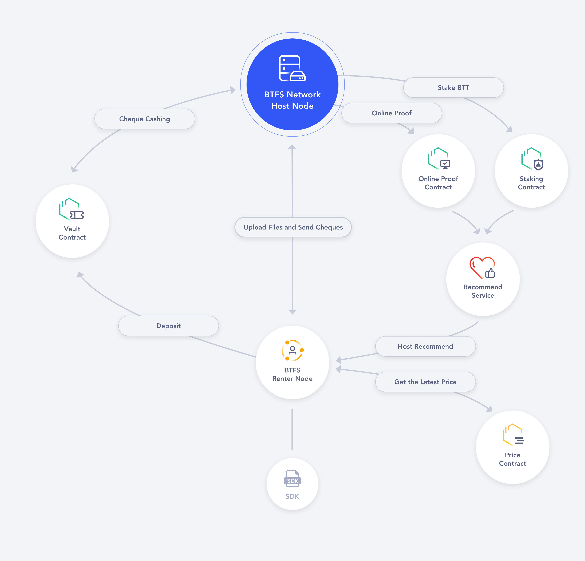
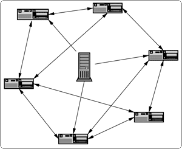

```btip: 1
title: Integrate with bittorrent
author: Shawn-Huang-Tron<shawn.huang@tron.network>
discussions-to: https://github.com/bittorrent/BTIPs/issues/1
status: Living
type: Client API
category (*only required for Core Protocol):
created: 2022-09-30
```

## Simple Summary

BTFS adds a new command/API to downloads the files of a specific bittorrent seed or a magnet URI scheme.

## Abstract

BTFS should integrate with the bittorrent libs to serve as a bittorrent client, and communicate with the tracker, DHT,webseed or bittorrent peers.Then downloads the content, after downloading completed, stop the communications with those p2p.

## Motivation

This BTIP can help the BTFS network integrate with the bittorrent network. And rich the BTFS's ecosystems. After that, may be a lot of people will transfer their bittorrent's storage to the BTFS.
Imagine these scenarios:

> - A BTFS host wants to download and save the bittorrent files so that he can reach it anywhere, then after this BTIP completed, he can find it via https://gateway.btfs.io/btfs/{cid} or another BTFS local gateway endpoint.
> - A bittorrent user that has not deployed the BTFS node can visit this file via https://gateway.btfs.io/btfs/{cid}.
> - Maybe some of the bittorrent user will try to view the BTFS as their alternatives, that will be very awesome for the BTFS ecosystem.

In all these scenarios, it will be good for BTFS ecosystem to transfer the bittorrent's file.

## Specification

BTFS(BitTorrent File System) is the next generation decentralized file storage system build for web 3.0 Applications. BTFS provides global decentralized storage service with high reliability. In BTFS 2.0, we reconstructed our framework by using smart contracts based on BTTC, ETH, TRON. Makes BTFS web 3.0 native and become more scalable along with low cost and high security.

It's architecture is illustrated as follows:


And BitTorrent is a free speech tool.

BitTorrent gives you the same freedom to publish previously enjoyed by only a select few with special equipment and lots of money. ("Freedom of the press is limited to those who own one" — journalist A.J. Liebling.)

You have something terrific to publish -- a large music or video file, software, a game or anything else that many people would like to have. But the more popular your file becomes, the more you are punished by soaring bandwidth costs. If your file becomes phenomenally successful and a flash crowd of hundreds or thousands try to get it at once, your server simply crashes and no one gets it.

There is a solution to this vicious cycle. BitTorrent, the result of over five years of intensive development, is a simple and free software product that addresses all of these problems.

The BitTorrent Solution:
Users cooperate in the distribution



**So we know they are different, not only their goals and function, but also architecture.** But they still have the same technology:P2P.And they are all decentralized!

And int this BTIP, We support the following BEP specification(BEP stands for BitTorrent Enhancement Proposal,see: [BEP-1](http://bittorrent.org/beps/bep_0001.html)):

> - core protocal: core protocal [BEP-3](http://bittorrent.org/beps/bep_0003.html)、Peer ID Conventions [BEP-20](http://bittorrent.org/beps/bep_0020.html)、
> - centerialization coordinator: tracker [BEP-3](http://bittorrent.org/beps/bep_0003.html)、udp tracker [BEP-15](http://bittorrent.org/beps/bep_0015.html)
> - DHT Protocol: [BEP-5](http://bittorrent.org/beps/bep_0005.html)
> - WebSeed: [BEP-19](http://bittorrent.org/beps/bep_0019.html)

### **And we provide the following commands:**

### 1.download a bittorrent file:

```shell
btfs bittorrent download -t torrent-file.torrent
```

### 2.download a magnet url:

```shell
btfs bittorrent download 'magnet:?xt=urn:btih:KRWPCX3SJUM4IMM4YF5RPHL6ANPYTQPU'
```

### 3.show metainfo for the specified bittorrent file:

```shell
btfs bittorrent metainfo -t xxx.torrent
```

### 4.show metainfo for the specified magnet URL:

```shell
btfs bittorrent metainfo -m 'magnet:?xt=urn:btih:KRWPCX3SJUM4IMM4YF5RPHL6ANPYTQPU'
```

### 5.fetch swarm metrics for info-hashes from tracker:

```shell
# -t tracker url, -i pieces of info-hashes which separated by commas
btfs bittorrent scrape -t '' -i ''
```

### 6.transfer the bencoded data to the person-readable json (according to [BEP-3](http://bittorrent.org/beps/bep_0003.html)):

```shell
btfs bittorrent bencode -f xxx.torrent
```

### 7.serve as a bittorrent client with the specified files:

```shell
# -f files which you want to share with the bittorrent network,separated by commas
btfs bittorrent serve -f 'xxx.mp4,xxx.jpeg'
# NOTE: This command will start a daemon to serve as a client and output the magnet url every file you tap in.
```

## Rationale

BTFS is dirrent from BitTorrent but they have something same such as they are all distributed network and decentralized.When we integrate with bittorrent, we consider the following steps:

1. Parsing the magnetic links to bittorrent metadata if the target is a magnet url.
2. Parsing the bittorrent file to bittorrent metadata if the target is a bittorrent seed file.
3. Judge by the bittorrent metadata and choose how to get peers by tracker/dht/webseed/peer.
4. Split the bittorrent metadata into a list of pieces and download all this pieces independently from the peers.
5. We can see the process of downloading in the console.
6. When downloading is finished, add this file to the local BTFS node by

```shell
btfs add file
```

7. Maybe we can add a more user-interactive friendly dashboard to view this process.

## Backwards Compatibility

true

## Test Cases

## Implementation

https://github.com/bittorrent/go-btfs/blob/pre_v2.3.0_union/core/commands/bittorrent.go
