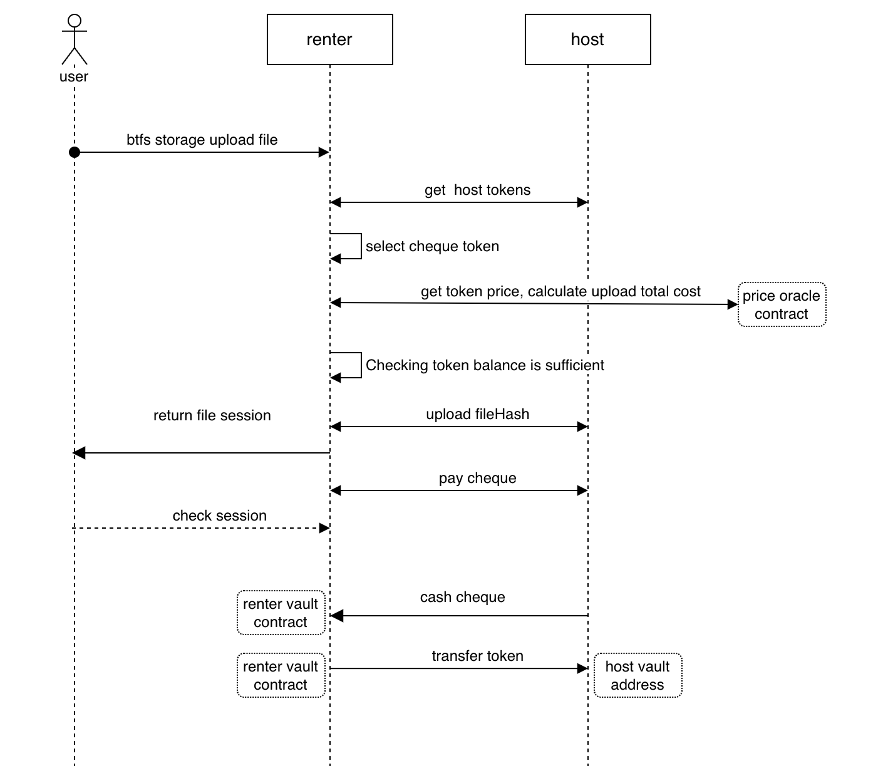

```
BTIP: 2
title: Vault contract support multi-tokens
author: laocheng-cheng<laocheng.cheng@tron.network>
discussions-to: https://github.com/bittorrent/BTIPs/issues/2
status: Final
type: Core Protocol
category (*only required for Core Protocol): Vault contract
created: 2022-10-17
```

## Simple Summary

In the BTFS, the cheque are sent and cashed using WBTT. Sometimes we want to add more tokens for sending and cashing cheque; Such as TRX, USDT, USDD, etc.

- 1.renter uploads the file and sends a cheque (with token) to host according to host support.
- 2.The host cashes the cheque, cashing the cheque amount (specified token) from renter's Vault Contract.

The overall flow chart is as follows：


## Abstract

Vault contract may support paying with TRX/USDT/USDD to satisfy more needs of the community and the renter can choose which kind of token to pay for the cheque.

When you have one or more of this three tokens(TRX/USDD/USDT) and do not want to convert the token to BTT, you can use the token you already have to pay for the uploaded file. And when host want to cash the vault, they must choose the tokens type of the renter sent.

## Motivation

This BTIP can convince the renter to choose a tokens type for the multi-tokens situation. And it should be expandable cause maybe we will support more tokens types.

## Specification

### 1.Vault contract:
 - a. Which tokens are supported by host (all supported by default)
   When renter issues a cheque, look at which tokens are supported by the host and select one to issue in order. (for example: WBTT TRX USDD USDT)

 - b. Which tokens are supported by renter( all are supported by default)? Initializing the token address.
   Multiple Tokens are initialized in the vault contract.

 - c. The host cashes the cheque, and transfers the token in renter vault contract.

### 2.Price oracle Contract:

We hope to calculate the cheque fee when uploading the file through the price oracle contract。
You can see here: [BTIP-9](https://github.com/bittorrent/BTIPs/issues/9)

### 3.Contract Upgrade plan
- a. According to the above modifications, develop and deploy new logical contracts, and pay attention to the problem of new global variables.
- b. Use a test proxy contract, all tests pass, then release. (Test whether the new global variable affects the current cumulative data of the contract)


### 4.Related Command Operations
#### 1.renter uploads file with setting the token
```shell
btfs cheque cash  16Uiu2HAkvWsNP5MVz5Spyo8qSgH8byMisnZHTZzxumZsLxYBzUzg--token-type WBTT
```

#### 2.host cashes cheque with setting the token
```shell
btfs storage upload QmUoeVZXWyGNiPLjNhvF2LfniWBKLQ7F2VmGWmtFLAvCr5 --token-type WBTT
```


## Rationale

cheque's operations are in the vault contract. Each node has a vault contract and a vault address. Sending cheque and cashing cheque are based on vault addresses.

### 1. The vault contract.
 - host supports token list Settings (all supported by default)
 - renter supports token list setting and initialization (all supported by default)
 - cheque cash operation, cheque information contains the currency symbol to support different currencies.

### 2. renter recharge with different tokens
   more tokens on different chains can be transferred to the bttc network, through the bttc cross-chain bridge.
   renter's vault address can be then recharged with a certain amount of more tokens.

### 3. GO-BTFS protocol
#### A. renter sends cheque, that can be signed with different tokens.

> Note:
> - Before renter issues the cheque, checks which tokens are supported by the host, and checks the balance of different tokens self, then select one token(default WBTT) to pay.
> - The token price can be determined based on the price contract. The Amount for uploading files is determined based on the file size and token price.
> - The cheque is currently accumulated. If you support multiple tokens, you need a separate cumulative value for each token.


firstly, To upload file, select token pseudocode:
```golang
if pointedToken != nil {
	if pointedToken is enough {
        useToken = pointedToken
    } else {
		return "your pointed token is not enough."
    }
}
 
if pointedToken == nil {
    if WBTT balance is enough  {
        useToken = WBTT
    } else if TRX balance is enough {
        useToken = TRX
    } else if USDD is enough {
        useToken = USDD
    } else if USDT is enough {
        useToken = USDT
    } else {
        return "none token to support."
    }
}

```

secondly, To upload file, select host logic pseudocode:
```golang
hostTokens = getHostTokens(host)
renterTokens = getRenterTokens(renter)
 
if useToken != nil {
    if useToken in hostTokens && useToken in renterTokens {
        useHost = host
    } else {
        return "current host is invalid."
    }
}

```

#### B. host cashes cheque, calls renter's vault contract. And host cashes cheque with different tokens. So command added parameters to distinguish between different tokens (--token-type [WBTT/TRX/USDD/USDT], default value: WBTT)

#### C. In the upload file command, add a parameter specifying the token to upload. (--token-type [WBTT/TRX/USDD/USDT], default value: WBTT).


## Backwards Compatibility

true

## Test Cases

## Implementation

<https://github.com/bittorrent/go-btfs/pull/269>
