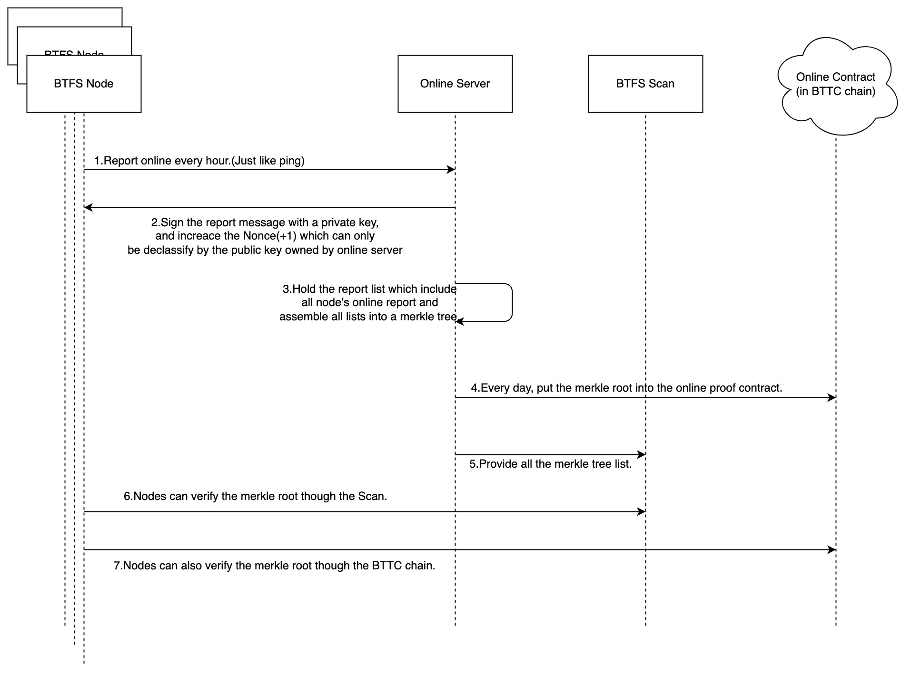

```btip: 20
title: Use merekle root for online proofs
author: Shawn-Huang-Tron<shawn.huang@tron.network>
discussions-to: https://github.com/bittorrent/BTIPs/issues/20
status: Final
type: Core Protocal
category (*only required for Core Protocol): Online Proof
created: 2022-12-01
```

## Simple Summary

As we all know, now our online proof is based on the bttc chain, and every node needs to report online data to bttc online contract once every day. It will spend node's gas. But recently we think that maybe it's not necessary to report daily online proof every node every day. We can collect all this reports and calculate it as a merkle root. And we just need to report this merkle root to online contract once every day for all nodes!
So that will save all the nodes gas and can prove it by merkle root.

## Abstract

Merkle tree has been applied in a lot of situation of blockchain.
It is used to verify any kind of data stored, handled and transferred in and between computers. They can help ensure that data blocks received from other peers in a peer-to-peer network are received undamaged and unaltered, and even to check that the other peers do not lie and send fake blocks.
In this situation, we will save all the node's cryptographic info about online proof as a merkle tree. And report the merkle root into the online contract every day so that the miners and community can verify the historical data about online proof.

## Motivation

This BTIP can help the BTFS miners reduce all their bttc gases which is generated during the report to the online contract.

## Specification

> In cryptography and computer science, a hash tree or Merkle tree is a tree in which every "leaf" (node) is labelled with the cryptographic hash of a data block, and every node that is not a leaf (called a branch, inner node, or inode) is labelled with the cryptographic hash of the labels of its child nodes. A hash tree allows efficient and secure verification of the contents of a large data structure. A hash tree is a generalization of a hash list and a hash chain.
Demonstrating that a leaf node is a part of a given binary hash tree requires computing a number of hashes proportional to the logarithm of the number of leaf nodes in the tree. Conversely, in a hash list, the number is proportional to the number of leaf nodes itself. A Merkle tree is therefore an efficient example of a cryptographic commitment scheme, in which the root of the tree is seen as a commitment and leaf nodes may be revealed and proven to be part of the original commitment. --wikipedia

Merkle tree is a good way to prove the online status.And nobody can change any node's value of merkle tree without changing it's merkle root.

In this situation, the node can keep their online status to our centralized server.
Centralized server sign a **Nonce** to the node. During the period time, very time the node report to centralized server, the **Nonce** will be increased(+1). Every day, every BTFS node will report a day-count **Nonce**. And centralized server collect all the node's report during this day. Build them as a merkle tree, save the tree to s3 or btfs publicly so that all nodes and community can check it.

Then put this merkle root to online contract in BTTC chain. Now nobody can change all historical online proof. Every node can trust the data that centralized server provided by checking it's merkle root!

## Rationale



1. Report online every hour(Just like ping).
2. Sign the report message with a private key,
and increace the Nonce(+1) which can only
be declassify by the public key owned by online server.
3. Hold the report list which include
all node's online report and
assemble all lists into a merkle tree(That means every day we will generate a merkle tree and merkle root by all BTFS node's report data(**Nonce**)).
4. Every day, put the merkle root into the online proof contract.
5. Provide all the merkle tree list(Maybe in s3 or BTFS network so that everyone can download it to check their **Nonce** and merkle root).
6. Nodes can verify the merkle root though the Scan.
7. Nodes can also verify the merkle root though the BTTC chain.

## Backwards Compatibility

Something changed in this version of online proof. BTFS nodes doesn't need to report online proof to online contract. But the older version of BTFS node can continue to report to online contract and its age score won't have effects.

## Test Cases

## Implementation

<https://github.com/bittorrent/go-btfs/pull/281/commits/4417f3c46a7ce4c1e14d09c8e371d9c7ee90c833>
