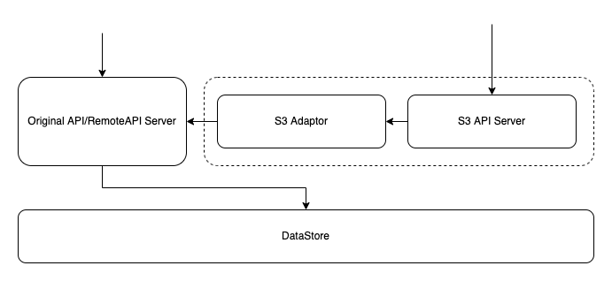

```btip: 25
title: Integrate with S3-Compatible API service
author: Steve Zhang<steve.zhang@tron.network>
discussions-to: https://github.com/bittorrent/BTIPs/issues/25
status: Last Call
type: Core Protocol
category (*only required for Core Protocol): S3-Compatible API
created: 2023-07-06
last-call-deadline: 2023-07-21
```

## Simple Summary

Add an AWS S3-Compatible API service on BTFS protocol implementation.

## Abstract

An adaptation layer compatible with the AWS S3 API is created in the BTFS protocol implementation. This layer exposes external-facing AWS S3-compatible API services and translates incoming AWS S3 object operations into corresponding operations for BTFS resources.

## Motivation

AWS S3 is widely adopted as a second-generation centralized cloud storage solution, allowing multitudinous applications to access it through its API protocol or SDKs. In contrast, BTFS as a third-generation decentralized storage protocol has yet to gain popularity, which means developers must redesign and develop their applications to be compatible with BTFS's API protocol. However, with a set of AWS S3-compatible API services from BTFS, it would be far easier for applications to be connected to BTFS or use it as an optional transparent storage layer.

## Specification

###  Add configuration and start command options

In the configuration file, you can now find a new section called S3CompatibleAPI which includes three options:

- Enable: This option determines whether to enable the S3-compatible API. Please note that its priority is lower than the daemon start command option.
- Address: Use this option to configure the service address for the S3-compatible API. Keep in mind that it can be accessed externally when the address is non-local.
- HTTPHeaders: Use this option to configure the response headers for the S3-compatible API service. It can also be used to set up cross-domain rules.

```text
   {
     ...
     "S3CompatibleAPI": {
       "Enable": false,
       "Address": "127.0.0.1:5201",
       "HTTPHeaders": {
         "Access-Control-Allow-Headers": [
           "X-Requested-With",
           "Range",
           "User-Agent"
         ],
         "Access-Control-Allow-Methods": [
           "GET"
         ],
         "Access-Control-Allow-Origin": [
           "*"
         ]
       }
     },
     ...
   }
```

Additionally, we have introduced a new string-type option 's3-compatible-api' in the start command. This option allows you to enable or disable the S3API service. Set it to 'enable' to start the service or 'disable' to prevent it from starting. By default, it is left empty, meaning that the value will be determined by the 'EnableS3API' field in the configuration file.

```shell
  btfs daemon --s3-compatible-api=enable
```

### Access Keys related commands. 

Add access key-related commands. Access keys are used for authenticating S3 API access requests, and each access key record consists of the key, secret, root, enable, and created_at fields:

- key: the id of the access key.
- secret: the secret of the access key.
- root: The root path of the key used in the BTFS mfs system, consisting of "/ + random directory name", each Access Key can only create a Bucket under its corresponding root.
- enable: indicates whether to enable the Access Key, the default is true, when the value is false, the request corresponding to the Access Key will be invalid.
- created_at: the creation time of the access key record.

#### 1. Generate Access Key
```shell
btfs s3-keys generate
{"key":"xxx","secret":"xxx","root":"/xxx","enable":true,"created_at":"xxxx-xx-xx xx:xx:xx"}
```

#### 2. Disable Access Key

```shell
btfs s3-keys disable <key>
```

#### 3. List all Access Keys

```shell
btfs s3-keys list
[{"key":"xxx","secret":"xxx","root":"/xxx","enable":true,"created_at":"xxxx-xx-xx xx:xx:xx"},{"key":"xxx","secret":"xxx","root":"/xxx","enable":true,"created_at":"xxxx-xx-xx xx:xx:xx"}]
```

#### 4. Delete Access Key

```shell
btfs s3-keys delete <key>
```

#### 5. Reset Access Key

```shell
btfs s3-keys reset <key>
{"key":"xxx","secret":"xxx","root":"/xxx","enable":true,"created_at":"xxxx-xx-xx xx:xx:xx"}
```

Note: this operation will only reset the secret associated with the key.

### Authentication

The BTFS S3-compatible API only supports [AWS v4 signatures (AWS4-HMAC-SHA256)](https://docs.aws.amazon.com/AmazonS3/latest/API/sig-v4-authenticating-requests.html) for authentication and does not support AWS v2 signatures at this time.

### Access Control Lists (ACLs)

- The BTFS S3-compatible API provides limited support for access control lists (ACLs), with no current support for object-level ACLs.
- The methods GetObjectAcl and GetBucketAcl will work as expected, but GetObjectAcl will return the ACL of the bucket it is in.
- A bucket's owner is the access key used to create the bucket (access keys cannot be changed at present), and only the owner can change the ACL of a bucket or delete the bucket.
- Supported predefined ACLs include private, public-read, and public-read-write; see AWS ACL for detailed definitions; permissions, by default, are set to public-read.
    - __private__: only the bucket owner can upload, delete, and read objects in the bucket, as well as read the list of the objects inside the bucket.
    - __public-read__: public-read: only the bucket owner can upload and delete objects in the bucket; however, public users, including anonymous ones, can read objects and the list of the objects inside the bucket.
    - __public-read-write__: public-read-write: public users, including anonymous ones, can upload, delete, and read objects in the bucket, as well as read the list of the objects inside the bucket.

### Supported API methods

#### 1. Supported Bucket Calls:

- CreateBuket
- HeadBucket
- ListBuckets
- DeleteBucket
- PutBucketAcl
- GetBucketAcl

#### 2. Supported Object Calls:

- ListObjects
- ListObjectsV2
- HeadObject
- PutObject
- CopyObject
- DeleteObject
- DeleteObjects
- GetObjectAcl

#### 3. Supported Multipart Calls:

- CreateMultipartUpload	
- AbortMultipartUpload
- CompleteMultipartUpload
- UploadPart

### Methods for obtaining BTFS Hash

You can get btfs hash from object metadata.
Object metadata key:

```json
{
   "Metadata": {
      "btfs-hash": "btfs cid"
   }
}
```

## Rationale

#### 1. Compatible adapter: convert the received S3 standard request into BTFS native API request and execute it, then convert the BTFS native API response into S3 standard response and return



- Start the S3-Compatible API server when start the BTFS daemon.
- Accept S3 standard request.
- Check the request authentication.
- Convert S3 standard request to a BTFS original request.
- Do BTFS original request, and gain the BTFS original response.
- Convert BTFS original response to S3 standard response.
- Return the S3 standard response.

```text
function handle_s3_request(s3_request) {
    ok = check_s3_request_auth(s3_request);
    if (!ok) {
        return auth_failed_error;
    }
    original_request = convert_s3_request_to_original_request(s3_request);
    original_response = do_original_request(original_request);
    s3_response = convert_original_response_to_s3_response(original_response);
    return s3_response;
}
```

#### 2. Start S3-Compatible API server according to the corresponding configuration or startup command options.

```text
if (option.s3-compatible-api == "enalbe" || (option.s3-compatible-api == "" && config.S3CompatibleAPI.Enable == true) {
    start_s3_compatible_api_server(config.Address.S3CompatibleAPI);
}
```

#### 3. Generate Access Key

```text
function generate_access_key() {
    key = random_string(key_length);
    secret = random_string(secret_length);
    ok = false;
    while(!ok) {
        root = path_join("/", random_dir_name());
        ok = btfs_files_mkdir(root);
    }
    access_key = {
        "key": key,
        "secret": secret,
        "root": root,
        "enable": true,
        "created_at": now()
    }
    store_access_key(access_key);
    return access_key;
}
```

#### 4. Create bucket

```text
function convert_s3_create_bucket_request_to_original_files_mkdir_request(s3_create_bucket_request) {
    access_key = get_access_key(s3_create_bucket_request.key);
    original_files_mkdir_request.path = join_path(access_key.root, create_bucket_request.bucket_name);
    return original_files_mkdir_request;
}
     
function handle_s3_create_bucket_request(s3_create_bucket_request) {
    ok = check_s3_request_auth(s3_create_bucket_request);
    if (!ok) {
        return auth_failed_error;
    }
    original_files_mkdir_request = convert_s3_create_bucket_request_to_original_files_mkdir_request(s3_create_bucket_request);
    original_files_mkdir_response = do_original_files_mkdir_request(original_files_mkdir_request);
    bucket_info = {
        "owner": access_key.key,
        "bucke_name": create_bucket_request.bucket_name,
        "path": original_files_mkdir_request.path,
        "cid": original_files_mkdir_response.cid,
        "acl": create_bucket_request.acl,
        "created_at": now()
    }
    store_bucket_info(bucket_info);
    return
}
```

## Backwards Compatibility

True

## Test Cases

## Implementation
