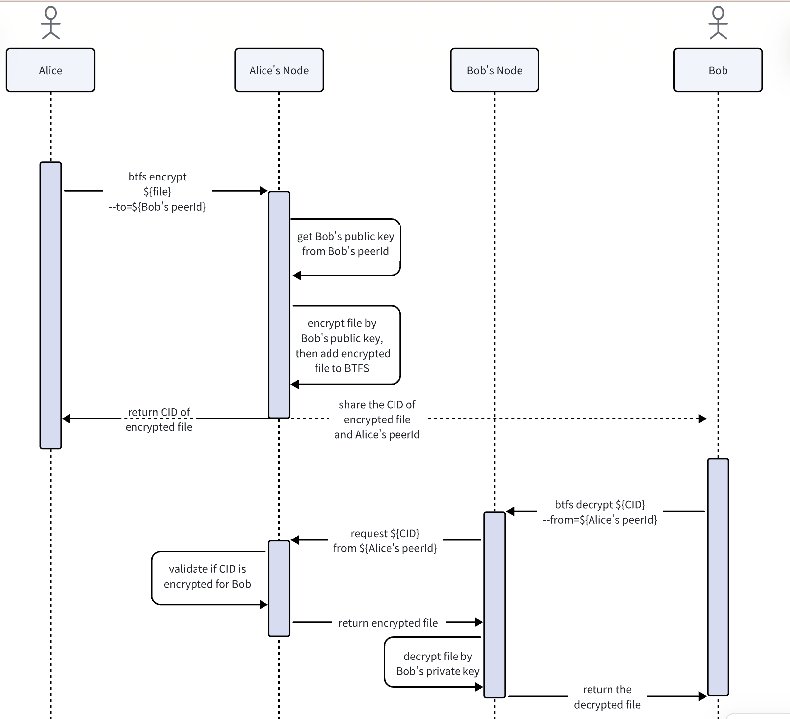

```
BTIP: 52
title: File share with encryption
author: Shawn-Huang-Tron<shawn.huang@tron.network>
discussions-to: https://github.com/bittorrent/BTIPs/issues/52
status: Last Call
last-call-deadline: 2023-12-08
type: Core Protocol
category (*only required for Core Protocol):
created: 2023-09-28
```

## Simple Summary

Sharing a public file on BTFS is quite easy at the moment since all it requires is sending the CID to the recipient. However, users sometimes want to upload private files visible only to themselves or designated users, which is not attainable on BTFS owing to the inherent nature of its underlying structure, where anything uploaded to BTFS can potentially be accessed by others. To tackle its deficiency with respect to private files, we hereby put forward this BTIP proposal.

## Abstract

This BTIP proposal aims to enable users to securely store and share private files on the publicly accessible BTFS by implementing a file encryption and decryption approach.

## Motivation

1. Users wish to keep the files they upload to BTFS private and inaccessible to anyone without authorization.
2. Users want to be able to share their private files with designated recipients.
3. Access to these private files is obtained through decryption using a simple private key or the private key of the corresponding node.

## Specification

The process is illustrated in the following flowchart:


1. Add a 'btfs encrypt' command, which can be used when users want to upload an encrypted file.
2. The command encrypts the file with the public key from the peerId and uploads it to the BTFS network to receive the CID of the encrypted file.
3. The peerId parameter is optional and defaults to the local peerId (i.e. only users themselves have access to the file).
4. Add a 'btfs decrypt' command to decrypt the CID for users.
5. The peerId parameter is optional and defaults to the local peerId. If a peerId is provided in the parameters, the encrypted file corresponding to the CID will be downloaded from the BTFS network first.
6. Users can decrypt the encrypted file with their own private key to obtain the plain text file.

Examples:

```shell
btfs encrypt ${file_path}
btfs encrypt ${file_path} --to=16Uiu2HAm63oRwPkf8qi92bFc1z6AVmD2ePvQfrkFyNgHRXjjKdtZ
 
btfs decrypt ${cid}
btfs decrypt ${file_path} --from=16Uiu2HAm63oRwPkf8qi92bFc1z6AVmD2ePvQfrkFyNgHRXjjKdtZ
```

## Rationale

The reasons for choosing asymmetric encryption over symmetric encryption are as follows:

1. Each node has its own public and private keys, which are easier and safer to use for file encryption and decryption.
2. With symmetric encryption, private keys are shared across parties, making them less secure and more challenging to store for each encrypted file.

However, asymmetric encryption may impact system performance more than the symmetric solution, potentially affecting user experience.

We conducted tests to assess the impact on latency and found that asymmetric encryption meets our needs:

| File Size | Encryption Time | Decryption Time | Machine |
| :--: | :-------: | :-------: | :-------: |
| 2.1 GB | 4.3s | 4.8s | 8C16G |
| 593 MB | 638ms | 985ms | 8C16G |
| 100 MB | 97ms | 153ms | 8C16G |
| 11 MB  | 10ms | 15ms | 8C16G |
| 1.3 MB | 1.4ms | 2.3ms | 8C16G |

## Backwards Compatibility

This new feature is backward-compatible and won’t cause breaking changes.

## Test Cases

## Implementation
