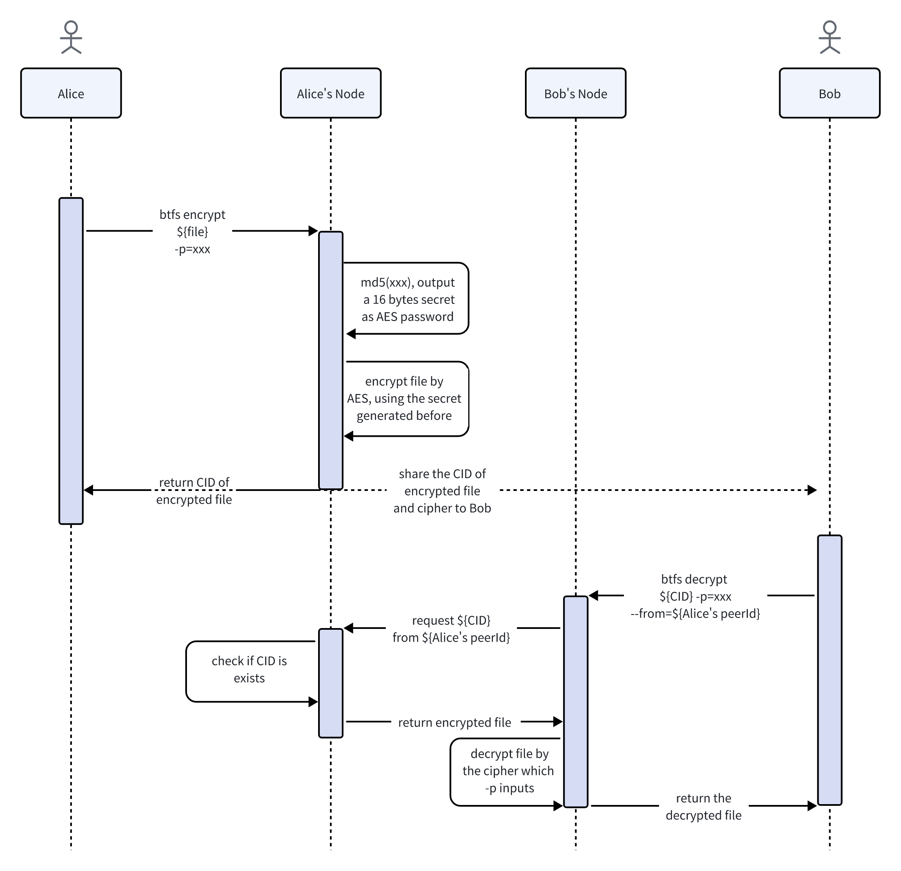

```
BTIP: 72
title: Support symmetric encryption when sharing files with BTFS
author: Shawn-Huang-Tron<shawn.huang@tron.network>
discussions-to: https://github.com/bittorrent/BTIPs/issues/72
status: Review
type: Core Protocol
category (*only required for Core Protocol):
created: 2024-05-07
```

## Simple Summary

Sharing a public file on BTFS is quite intuitive at the moment since all it requires is sending the CID to the recipient. However, users sometimes want to upload private files visible only to themselves or designated users. This is not attainable on BTFS owing to the inherent nature of its underlying structure, where anything uploaded to BTFS can potentially be accessed by others. To address this limitation, [BTIP-52](https://github.com/bittorrent/BTIPs/blob/master/BTIPS/BTIP-52.md) was introduced.

This BTIP builds upon [BTIP-52](https://github.com/bittorrent/BTIPs/blob/master/BTIPS/BTIP-52.md) and aims to provide users with the option of symmetric encryption.

## Abstract

This BTIP enhances the functionality of [BTIP-52](https://github.com/bittorrent/BTIPs/blob/master/BTIPS/BTIP-52.md) by adding symmetric encryption as a new option.

## Motivation

1. Users wish to keep their files uploaded to BTFS private and inaccessible to anyone without authorization.
2. Users want to be able to share their private files with designated recipients.
3. Access to these private files is obtained through decryption using the original cipher text.

## Specification

The interaction process is illustrated in the following flowchart:


1. -p is added to btfs encrypt as a new option, and users can input it when using symmetric encryption;
2. The command will encode the -p input with MD5 hash and generate a 16-byte key;
3. The file is encrypted with the AES algorithm using the key generated in the previous step and then uploaded to the BTFS network, after which the CID of the encrypted file will be returned;
4. The -p option is also added to the btfs decrypt command to help users unscramble the encrypted file with the corresponding CID;
5. The peerId parameter is optional and defaults to the local peerId. If a peerId is provided in the parameters, the encrypted file corresponding to the CID will be retrieved and downloaded from the BTFS network first;
6. After downloading the encrypted file, the recipient can use the cipher text to decrypt it and obtain the plain-text file by using the AES algorithm.

Examples:

```shell
# Symmetric encryption
btfs encrypt ${file_path} -p=xxx

# Obtain the encrypted file from the local node and use the symmetric key for decryption
btfs decrypt ${cid} -p=xxx
# Obtain the encrypted file from other nodes and use the symmetric key for decryption
btfs decrypt ${file_path} --from=16Uiu2HAm63oRwPkf8qi92bFc1z6AVmD2ePvQfrkFyNgHRXjjKdtZ -p=xxx
```

## Rationale

Symmetric encryption is a useful and straightforward complement to asymmetric encryption and fits in well with different user scenarios.

## Backwards Compatibility

This new feature is backward-compatible and won’t cause breaking changes.

## Test Cases

## Implementation
