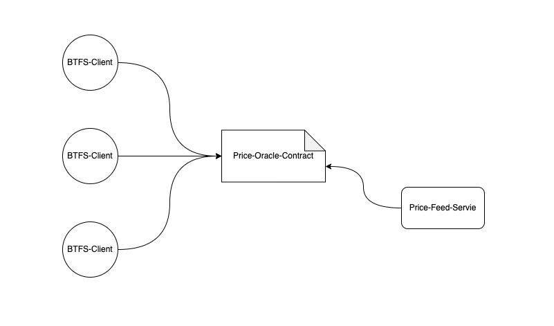

```
BTIP: 9
title: Vault contract support multi-coin
author: laocheng-cheng<laocheng.cheng@tron.network>
discussions-to: https://github.com/bittorrent/BTIPs/issues/9
status: Final
type: Core Protocol
category (*only required for Core Protocol): Vault contract
created: 2022-10-21
```

## Simple Summary

The BTFS client fetch the storage price(WBTT) from the Price Oracle contract. To support multi-tokens, we need upgrade this contract to feed and query upload price of the other tokens(TRX/USDT/USDD).

## Abstract

Currently in BTFS, Upload files at the specified storage price of xxx WBTT/G/Month, and now plans to support more token prices. This gives you more options when uploading files on renters.

## Motivation

If multi-tokens payment scheme is implemented, it is more prominent how the storage price of multi-currency is set.

It is assumed that the storage price of BTFS is fixed (xxx WBTT/G/Month), and the prices of other tokens are used as a reference and set to floating exchange rates with reference to the market situation. Then it is possible to calculate different token prices in comparative real time.

## Specification

### 1.Price Oracle Contract:
- Add two mappings to save the storage price and price rate of the specified token. (token => price*rate WEI/G/Month)
```solidity
    mapping (address => uint256) public prices;
    mapping (address => uint256) public rates;
```

- Add a public method for contract owner to update the storage prices and prices rates of the specified tokens 
```solidity
    function updatePricesAndRates(address[] calldata tokens, uint256[] calldata newPrices, uint256[] calldata newRates) external onlyOwner {
    require(tokens.length > 0, "length not grater than 0");
    require(tokens.length == newPrices.length, "new prices length not match");
    require(tokens.length == newRates.length, "new rates length not match");
    for (uint256 i = 0; i < tokens.length; i++) {
        prices[tokens[i]] = newPrices[i];
        rates[tokens[i]] = newRates[i];
    }
    emit PricesAndRatesUpdate(tokens, newPrices, newRates);
}
```

- Add a public method for BTFS client to query prices and price rates of the specified tokens
```solidity
    function getPricesAndRates(address[] calldata tokens) external view returns (uint256[] memory pricesResult, uint256[] memory ratesResult) {
    require(tokens.length > 0, "tokens length not greater than 0");
    pricesResult = new uint256[](tokens.length);
    ratesResult = new uint256[](tokens.length);
    for (uint256 i = 0; i < tokens.length; i++) {
        pricesResult[i] = prices[tokens[i]];
        ratesResult[i] = rates[tokens[i]];
    }
}
```
### 2.Price Feed Service
- Configure the storage price of WBTT as the fixed price
```
storage_price_of_WBTT = <fixed_price_number>;
```

- Fetch the exchange rate From WBTT to the other tokens(TRX/USDT/USDD) from third party platform regularly
```
exchange_rate_of_WBTT_to_TRX = getExchangeRate('WBTT', 'TRX');
storage_price_of_TRX = storage_price_of_WBTT * exchange_rate_of_WBTT_to_TRX; 
```

- Call the Price Oracle contract to update the storage price(exchange rate * WBTT's storage price) of all tokens
```
PriceOracleContract.UpdatePricesAndRates(...);
```
## Rationale

- The storage prices and prices rates of all tokens are regularly calculated off chain
- The WBTT's price is set as a fixed price, and the other token's price is anchor to the WBTT's price
- The other token's exchange rate to WBTT is fetched from third party platform(e.g.poloniex)
- The storage prices and rates of all tokens finally be written to a contract(Price Oracle Contract)
- All BTFS clients query the storage prices and rates from the Price Oracle Contract

## Backwards Compatibility

true

## Test Cases

## Implementation

<https://github.com/bittorrent/btfs-vault/releases/tag/v2.3.0>
