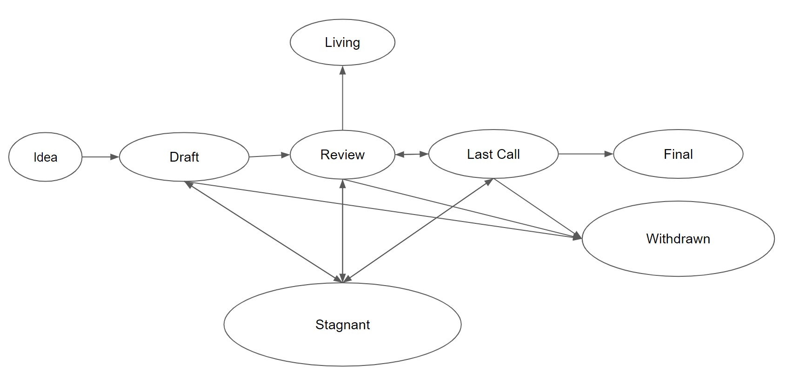

# BTIPs

The BTFS Improvement Proposal repository

BitTorrent File System Improvement Proposals (BTIPs) describe standards for the BTFS platform, including core protocol specifications and client APIs.

## Contributing

First review this README. Then clone the repository and add your BTIP to it. There is a template BTIP here. Then submit a Pull Request to this repository.

## BTIP status terms

- **Idea** - An idea that is pre-draft. This is not tracked within the BTIP Repository.
- **Draft** - The first formally tracked stage of an BTIP in development. An BTIP is merged by an BTIP Editor into the BTIP repository when properly formatted.
- **Review** - An BTIP Author marks an BTIP as ready for and requesting Peer Review.
- **Last Call** - This is the final review window for an EIP before moving to - FINAL. An BTIP editor will assign Last Call status and set a review end date (`last-call-deadline`), typically 14 days later. If this period results in necessary normative changes it will revert the BTIP to Review.
- **Final** - This BTIP represents the final standard. A Final EIP exists in a state of finality and should only be updated to correct errata and add non-normative clarifications.
- **Stagnant** - Any EIP in Draft or Review if inactive for a period of 3 months or greater is moved to Stagnant. An BTIP may be resurrected from this state by Authors or BTIP Editors through moving it back to Draft.
- **Withdrawn** - The BTIP Author(s) have withdrawn the proposed BTIP. This state has finality and can no longer be resurrected using this BTIP number. If the idea is pursued at later date it is considered a new proposal.
- **Living** - A special status for EIPs that are designed to be continually updated and not reach a state of finality.

## The standardization process about the status

## BTIP status type

| type name |     description |
| :--: | :-------: |
| core protocol  | this kind of BTIP will affect core protocal |
| client api  | this kind of BTIP will affect client api |compatible |

## All BTIPs list

|   ID   |                              Title                               |              Author              |  Type  |     Category      |  Status   |
|  :---: |:----------------------------------------------------------------:|:--------------------------------:| :----: |:-----------------:|:---------:|
| BTIP-1 |      [Integrate With BitTorrent Protocol](BTIPS/BTIP-1.md)       |    <shawn.huang@tron.network>    | client api |                   |  Living   |
| BTIP-2 |      [Vault Contract Support Multi-Tokens](BTIPS/BTIP-2.md)      |  <laocheng.cheng@tron.network>   | core protocal |  Vault contract   |   Final   |
| BTIP-9 | [Price Oracle Contract to Support Multi-Tokens](BTIPS/BTIP-9.md) |  <laocheng.cheng@tron.network>   | core protocal |  Vault contract   |   Final   |
| BTIP-20 |      [Use merekle root for online proofs](BTIPS/BTIP-20.md)      |    <shawn.huang@tron.network>    | core protocal |   Online Proof    |   Final   |
| BTIP-25 |   [Integrate With S3-Compatible API Service](BTIPS/BTIP-25.md)   | <steve.zhang@tron.network> | core protocal | S3-Compatible API | Last Call |
